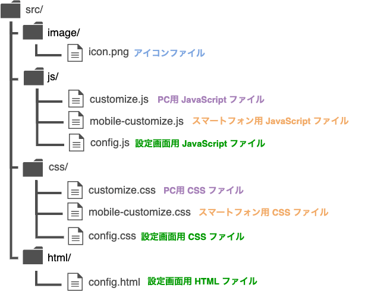

# TEQS　AIビジネス研究会

[第20回AIビジネス研究会-「kintone×AI」で広がるビジネスチャンス！](https://www.sansokan.jp/events/eve_detail.san?H_A_NO=45261)

## ワークショップの部

### 今回できる簡単なデモ

### 内容

デモ用の問い合わせ管理アプリのレコードを取得して、条件に会うレコードをOpen AIの渡して対応の優先度を割り振るプラグインです。

## kintoneプラグインの基本的な構成：

### そのうち今回編集されるファイル：

| ファイル名    | パス                 | 備考 |
| ------------- | -------------------- | ---- |
| manifest.json | src/manifest.json    |      |
| config.js     | src/js/config.js     |      |
| desktop.js    | src/js/desktop.js    |      |
| config.html   | src/html/config.html |      |

### 利用するデモアプリのインストール

