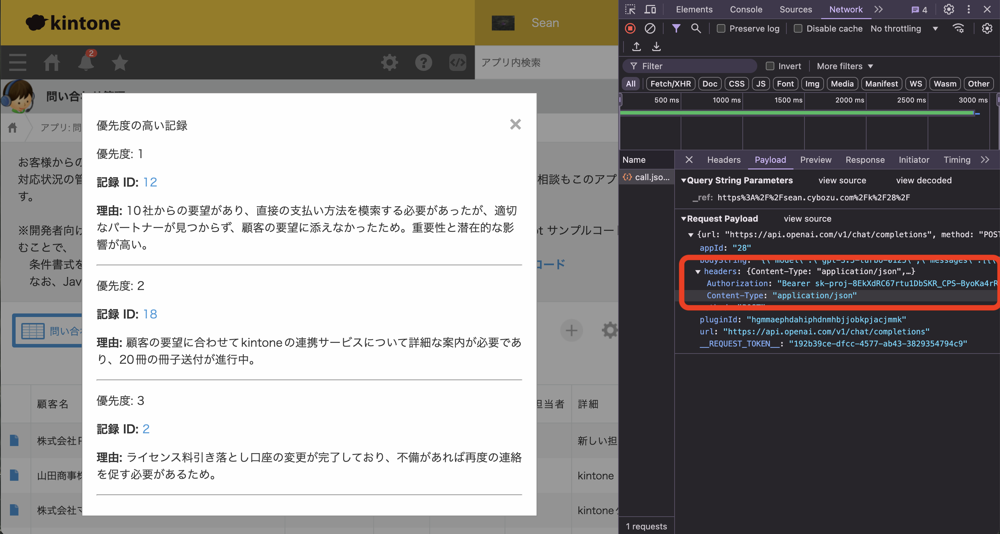

# TEQS kintone Plugin 開発セミナー

## 環境を用意する

### NodeJS

`node -v`を実行して、20以上のバージョンがインストールされているかをご確認ください

例：`v23.1.0`

## kintoneを準備する

### 開発者ライセンスを取得する

[開発者ライセンスを取得してみよう！](https://cybozu.dev/ja/kintone/developer-license/registration-form/)

kintone開発者ライセンスは、開発者がkintone APIを無料で試せる環境を提供します。顧客または自社向けの開発・テストや、開発スキルの習得に活用できます。

### デモ用アプリを追加する


ログイン後、アプリ追加画面からデモ用の「問い合わせ管理」アプリをインストールしてください。


## プラグインを作成してみよう

`npm install -g @kintone/create-plugin`

`create-kintone-plugin test-ai-plugin`

質問に対して、ホームページとアップロード以外をデフォルトで回答しましょう
ホームページも指定しないと、`customize-uploader`は失敗します。

``` txt
? Input your plug-in name in English [1-64chars] test-ai-plugin
? Input your plug-in description in English [1-200chars] test-ai-plugin
? Does your plug-in support Japanese? no
? Does your plug-in support Chinese? no
? Does your plug-in support Spanish? no
? Input your home page url for English (Optional) https://test.com
? Does your plug-in support mobile views? no
? Would you like to use @kintone/plugin-uploader? yes
```

作成したディレクトリに入って、パッケージをインストールします：

`cd test-ai-plugin`

`npm i`

### envファイルを使用してアップしましょう

`npm install dotenv-cli`

`touch .env`

.envファイルを下記の内容でコピペする

``` txt
KINTONE_BASE_URL=https://xxx.cybozu.com
KINTONE_USERNAME=xxx
KINTONE_PASSWORD=xxx
```

ご自身のkintone環境関数を入れて保存しましょう。

### package.jsonでdotenvを使用する

uploadのコマンドの頭に 「dotenv --」 を付け足して、env関数を使用してアップを試す

``` json
"upload": "dotenv -- kintone-plugin-uploader dist/plugin.zip --watch --waiting-dialog-ms 3000"
```

## プラグインを読み込んでみよう

`npm start`

コマンドが成功したら、kintone上で確認しましょう


## 設定画面を変更してみる

config設定は３つの要素を設置しないといけない：
- HTMLフィルド
- JSで関数保存・取得
- manifest.jsonで必須項目にする（任意）

### まずはmanifest.json

[manifest.json](../src/manifest.json)

configオブジェクト内の`required_params`に`message`（デフォルト）が必須設定になっています。
`message`を`openAIToken`に変えておきましょう。

``` json
{
...
  "config": {
    "html": "html/config.html",
    "js": [
      "js/config.js"
    ],
    "css": [
      "css/51-modern-default.css",
      "css/config.css"
    ],
    "required_params": [
      "openAIToken"
    ]
  },
...
```

### 次はHTML

[config.html](../src/html/config.html)

デフォルトでは　`message`　が必須項目として設置されています。
これを試しで`openAIToken`に変えておきます。

``` html
<section class="settings">
  <h2 class="settings-heading">設定画面</h2>
  <p class="kintoneplugin-desc">Open AI連携プラグインの設定</p>
  <form class="js-submit-settings">
    <p class="kintoneplugin-row">
      <label for="openAIToken">
        OpenAI APIトークン:
        <input type="text" class="js-text-message kintoneplugin-input-text openAIToken">
      </label>
    </p>
    <p class="kintoneplugin-row">
        <button type="button" class="js-cancel-button kintoneplugin-button-dialog-cancel">Cancel</button>
        <button class="kintoneplugin-button-dialog-ok">Save</button>
    </p>
  </form>
</section>
```

これを保存すると、設定画面に文言が変わっています。
ただ、裏で動いているJSを変えないと、関数を保存したり、取得したりすることができない。

### 最後はJS

[config.js](../src/js/config.js)

デフォルトのJSです。
中に、２か所を修正します：
- HTMLフィルド取得
- 関数の保存
``` js
(function (PLUGIN_ID) {
  const formEl = document.querySelector('.js-submit-settings');
  const cancelButtonEl = document.querySelector('.js-cancel-button');
  const messageEl = document.querySelector('.js-text-message');
  if (!(formEl && cancelButtonEl && messageEl)) {
    throw new Error('Required elements do not exist.');
  }

  const config = kintone.plugin.app.getConfig(PLUGIN_ID);
  if (config.message) {
    messageEl.value = config.message;
  }

  formEl.addEventListener('submit', (e) => {
    e.preventDefault();
    kintone.plugin.app.setConfig({ message: messageEl.value }, () => {
      alert('The plug-in settings have been saved. Please update the app!');
      window.location.href = '../../flow?app=' + kintone.app.getId();
    });
  });

  cancelButtonEl.addEventListener('click', () => {
    window.location.href = '../../' + kintone.app.getId() + '/plugin/';
  });
})(kintone.$PLUGIN_ID);
```

とりあえず、`message`になっているところを`openAIToken`に変更します。

``` js
(function (PLUGIN_ID) {
  const formEl = document.querySelector('.js-submit-settings');
  const cancelButtonEl = document.querySelector('.js-cancel-button');
  const openAITokenEl = document.querySelector('.openAIToken');
  if (!(formEl && cancelButtonEl && openAITokenEl)) {
    throw new Error('Required elements do not exist.');
  }

  const config = kintone.plugin.app.getConfig(PLUGIN_ID);
  if (config.openAIToken) {
    openAITokenEl.value = config.openAIToken;
  }

  formEl.addEventListener('submit', (e) => {
    e.preventDefault();
    kintone.plugin.app.setConfig({ openAIToken: openAITokenEl.value }, () => {
      alert('The plug-in settings have been saved. Please update the app!');
      window.location.href = '../../flow?app=' + kintone.app.getId();
    });
  });

  cancelButtonEl.addEventListener('click', () => {
    window.location.href = '../../' + kintone.app.getId() + '/plugin/';
  });
})(kintone.$PLUGIN_ID);

```

## ボタンを設置する

[desktop.js](../src/js/desktop.js)

kintone開発のあるあるファストステップです。
今回は普通のJSにしていますが、お好みのフレームワーク（Reactなど）を使用することも可能です。
`app.record.index.show`イベントの`event`オブジェクトにレコードデータが入っていますので、最初から定義します。
そして、画面の上部にあるヘッダー要素を取得して、ボタンを作成して挿入します。
``` js
  kintone.events.on('app.record.index.show', (event) => {
    //kintoneレコードデータ
    const records = event.records;

    const headerSpace = kintone.app.getHeaderMenuSpaceElement();
    if (headerSpace === null) {
      throw new Error('このページでヘッダー要素が利用できません。');
    }
    const button = document.createElement('button');
    button.id = 'auto-priority-button';
    button.textContent = '自動優先度計算';
    button.style.marginTop = '10px';
    button.addEventListener('click', async () => {
        console.log("ボタンはクリックされました。")
      try {
        // 実行する関数
        createModal()
      } catch (error) {
        // エラー処理
      } finally {
        // 片付け処理
      }
    });
    headerSpace.appendChild(button);
    return event;
  });
```

保存とアップすると、デフォルトメッセージだった箇所がボタンになっています。
今回は`app.record.index.show`イベントで表示していますが、kintone内のそれぞれの画面表示・保存時などのイベントはカスタマイズ可能です。

## モダルを表示してみる

別の関数を定義して、ボタン押した時に表示してみましょう。
こういう時はフレームワークやCSSライブラリーは便利になってきますね。

``` js
function createModal() {
  const modal = document.createElement('div');
  modal.id = 'priority-modal';
  modal.style.display = 'block';
  modal.innerHTML = `
    <div class="modal-content">
      <span class="close">&times;</span>
      <h2>優先度の高い記録</h2>
      <div id="priority-records"></div>
    </div>
  `;
  document.body.appendChild(modal);

  const closeBtn = modal.querySelector('.close');
  closeBtn.onclick = () => {
    modal.style.display = 'none';
  };
  window.onclick = (event) => {
    if (event.target === modal) {
      modal.style.display = 'none';
    }
  };
  return modal;
}
```

また、CSSを付けます。

[desktop.css](../src/css/desktop.css)

``` css
  #priority-modal {
    display: none;
    position: fixed;
    z-index: 1000;
    left: 0;
    top: 0;
    width: 100%;
    height: 100%;
    background-color: rgba(0,0,0,0.4);
  }
  .modal-content {
    background-color: #fefefe;
    margin: 15% auto;
    padding: 20px;
    border: 1px solid #888;
    width: 80%;
    max-width: 600px;
  }
  .close {
    color: #aaa;
    float: right;
    font-size: 28px;
    font-weight: bold;
    cursor: pointer;
  }
  .close:hover,
  .close:focus {
    color: black;
    text-decoration: none;
    cursor: pointer;
  }
```

## kintoneレコード情報を取得する

モダルは表示できていますので、kintone内のデータを取得しましょう。ここは簡単です。

`calculateSentiment`という関数を定義します。以前定義した`records`関数をパラムとして入れます。
今回のアプリでは、問い合わせステータスに「完了」というのがありますので、弾いて利用します。
デモのため、「詳細」と「問い合わせ履歴」のサブテーブルを使います。サブテーブルは何行もあり得るため、ループして文字として付け加えていきます。

``` js
async function calculateSentiment(records) {
    // プラグイン設定からAPIキーを取得
    const config = kintone.plugin.app.getConfig(PLUGIN_ID);
    const openAIToken = config.openAIToken;
    const filteredRecords = records.filter(record => record.Status.value !== "完了");
    const processedRecords = filteredRecords.map(record => ({
      id: record.$id.value,
      detail: record.Detail.value,
      detailsTable: record['対応詳細'].value.map(row => row.value['文字列__複数行__1'].value).join(' ')
    }));
}
```

## レコード情報をOpen AI APIに渡す

いよいよプロンプトですね。ここはまだ目的とAIの機嫌によって変わってきますが、今回は下記の通りにしています：

``` js
const prompt = `以下の顧客サポート記録を分析し、優先度の高い上位3件を選んでください。各記録の重要性、緊急性、潜在的な影響を考慮してください。
  回答は、以下のJSONオブジェクトの配列形式で提供してください：
  records: [
    {
      "record": {
        "id": number,
        "priority": number,
        "reason": string
      }
    },
    ...
  ]
  priorityは1（最高）から3の数値で表してください。reasonは選択した理由を簡潔に説明してください。
  以下が分析対象の記録です：
  ${JSON.stringify(processedRecords, null, 2)}`;
```

今回はデモですが、AIにどういうところを重視して欲しいや、判断する要素（締め切り、最後にいつ連絡とったかなど）を与えると、より実用性が上がるでしょう。

次にOpen AI APIにリクエストします。プラグインですので、単純なFetchリクエストはできません。`kintone.plugin.app.proxy`リクエストにしないといけないです。
今回は「gpt-3.5」にしています。お好みのAI APIがあれば、リクエスト処理を入れ替えたら利用できます。
最近（2024年10月）に出た新機能：`response_format: { type: "json_object" }`を利用します。以前はプロンプト力で正しい形に返却してもらわないとエラー処理が大変でしたが、これならば、必ず指定したjsonで返してくれます。便利ですね。

``` js
    const body = {
      model: "gpt-3.5-turbo-0125",
      messages: [
        {
          role: "system",
          content: "You are a helpful assistant designed to output JSON."
        },
        {
          role: "user",
          content: prompt
        }
      ],
      response_format: { type: "json_object" }
    };
    try {
      const response = await kintone.plugin.app.proxy(PLUGIN_ID, 'https://api.openai.com/v1/chat/completions', 'POST', {
        'Content-Type': 'application/json',
        'Authorization': `Bearer ${openAIToken}`
      }, JSON.stringify(body));
      const parsedResponse = JSON.parse(response[0]);
      console.log(parsedResponse)
      const content = JSON.parse(parsedResponse.choices[0].message.content);
      console.log(content)
      return content.records;

    } catch (error) {
      console.error('Error calling OpenAI API:', error);
      return [];
    }
```

ここで一度テストすると良いかもしれません。
以前の`app.record.index.show`のtry catchの処理に入れてみましょう。

``` js
    button.addEventListener('click', async () => {
      console.log("ボタンはクリックされました。")
      try {
        const priorityRecords = await calculateSentiment(event.records);
        console.log('Prioritized records:', priorityRecords);
        if (priorityRecords.length > 0) {
          return
        } else {
          alert('優先度の計算結果が得られませんでした。ログを確認してください。');
        }
      } catch (error) {
        console.error('Error calculating priorities:', error);
        alert('優先度の計算中にエラーが発生しました。コンソールログを確認してください。');
      } finally {
        button.disabled = false;
        button.textContent = '自動優先度計算';
      }
    });
```

consoleに出力されたらOKです。

## 結果を表示する

それでは、モダルもあるし、AIの結果もあるし、組み合わせてみましょう。
`displayPriorityRecords`関数を定義します。モダルはDOMに存在していれば、取得するが、なければ作成します。
また、単純なJS DOM操作で`innerHTML`を変更しておきます。
それぞれの返却直にループして、理由を引き出して表示します。
``` js
function displayPriorityRecords(priorityRecords) {
  const modal = document.getElementById('priority-modal') || createModal();
  const recordsContainer = modal.querySelector('#priority-records');
  recordsContainer.innerHTML = '';
  const appId = kintone.app.getId();
  const baseUrl = `${location.origin}/k/${appId}/show#record=`;

  priorityRecords.forEach(item => {
    const recordDiv = document.createElement('div');
    recordDiv.innerHTML = `
      <h3>優先度: ${item.record.priority}</h3>
      <p><strong>記録 ID:</strong> <a href="${baseUrl}${item.record.id}" target="_blank">${item.record.id}</a></p>
      <p><strong>理由:</strong> ${item.record.reason}</p>
      <hr>
    `;
    recordsContainer.appendChild(recordDiv);
  });

  modal.style.display = 'block';
}
```

また`app.record.index.show`のtry catch処理に入れてみます。


``` js
      try {
        const priorityRecords = await calculateSentiment(event.records);
        console.log('Prioritized records:', priorityRecords);
        if (priorityRecords.length > 0) {
          displayPriorityRecords(priorityRecords)
        } else {
          alert('優先度の計算結果が得られませんでした。ログを確認してください。');
        }
      } catch (error) {
        console.error('Error calculating priorities:', error);
        alert('優先度の計算中にエラーが発生しました。コンソールログを確認してください。');
      } finally {
        button.disabled = false;
        button.textContent = '自動優先度計算';
      }
```

これで、一応動きます！
対応していないケースは恐らく：
- AIは配列じゃない形で返してしまった。
- 送信したレコード数が少ない
- レコードが大変多いアプリならば`offset`を利用して全レコードを送らないといけない
などなど。
それらはまた[devnet](https://cybozu.dev)のドキュメンテーションや[フォーラム](https://community.cybozu.dev/)にご確認できます。

ただ、最後に１つ、プラグインならではできるセキュリティ対策を紹介します。

## セキュリティー対策

 WEB開発に慣れている方はすでにわかっているかと思いますが、コードこのままでは、貴重なAPIトークンは一般ユーザにまる見えになっています。`F12`の開発ツールの`Network`タブを開くと、送信したリクエストを閲覧できます：



これを解決するには、[kintone.plugin.app.setProxyConfig(url, method, headers, data, successCallback)](https://cybozu.dev/ja/kintone/docs/js-api/plugins/set-config-for-proxy/)を利用します。

詳細は記事で読んでいただければと思いますが、これを利用することでConfigにあるAPIトークンを指定せずに、勝手に裏で取得してくれます。

[config.js](../src/js/config.js)

``` js
(function (PLUGIN_ID) {
  const formEl = document.querySelector('.js-submit-settings');
  const cancelButtonEl = document.querySelector('.js-cancel-button');
  const openAITokenEl = document.querySelector('.openAIToken');

  if (!(formEl && cancelButtonEl && openAITokenEl)) {
    throw new Error('Required elements do not exist.');
  }

  const config = kintone.plugin.app.getConfig(PLUGIN_ID);
  if (config.openAIToken) {
    openAITokenEl.value = config.openAIToken;
  }

  formEl.addEventListener('submit', (e) => {
    e.preventDefault();
    kintone.plugin.app.setConfig({ openAIToken: openAITokenEl.value }, () => {
      const openAIToken = openAITokenEl.value;
      console.log(openAIToken)
      const headers = {
        'Content-Type': 'application/json',
        'Authorization': `Bearer ${openAIToken}`
      };
      kintone.plugin.app.setProxyConfig('https://api.openai.com/v1/chat/completions', 'POST', headers, {});
      alert('設定が保存されました。アプリを更新してください。');
    })
    window.location.href = '../../flow?app=' + kintone.app.getId();
  });

  cancelButtonEl.addEventListener('click', () => {
    window.location.href = '../../' + kintone.app.getId() + '/plugin/';
  });
})(kintone.$PLUGIN_ID);
```

変更点はここです：

``` js
const headers = {
        'Content-Type': 'application/json',
        'Authorization': `Bearer ${openAIToken}`
      };
kintone.plugin.app.setProxyConfig('https://api.openai.com/v1/chat/completions', 'POST', headers, {});
```

自動で取得したいヘッダーと対象URLを指定して保存して、[desktop.js](../src/js/desktop.js)のリクエストの方で下記のように変えます：

``` js
const response = await kintone.plugin.app.proxy(PLUGIN_ID, 'https://api.openai.com/v1/chat/completions', 'POST', {}, JSON.stringify(body));
```

また、APIトークンを取得していたコードを削除できます。

トークンを指定していたところを空のオブジェクトにすると、Configでセットしたヘッダーを取得して送信してくれます。
例の開発ツールの`Network`タブをみると、私たちのブラウザから送信されているリクエストにトークン情報は含まれていないのに、ちゃんとOpenAI APIに届いています。素晴らしい。

以上、簡単なAI連携プラグインを作成しました。今回はデモ用アプリでたった20件のレコードでデモをしていましたが、エンタプライズ系のkintone環境だと1000ユーザだったり、１アプリに10000件のレコードだったり、複数のアプリがあって一元化できていないなどなどの問題はあり得ます。そういった問題を解決できるプラグインは市場にニーズがあると個人的に思います。それでは、良い開発を！