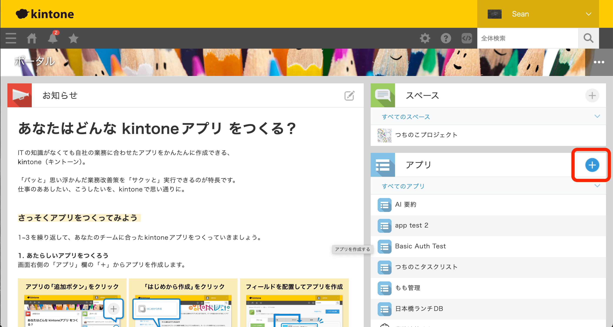
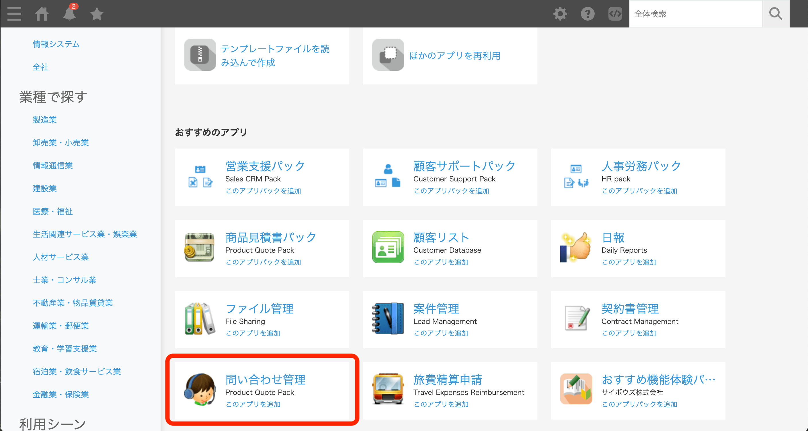
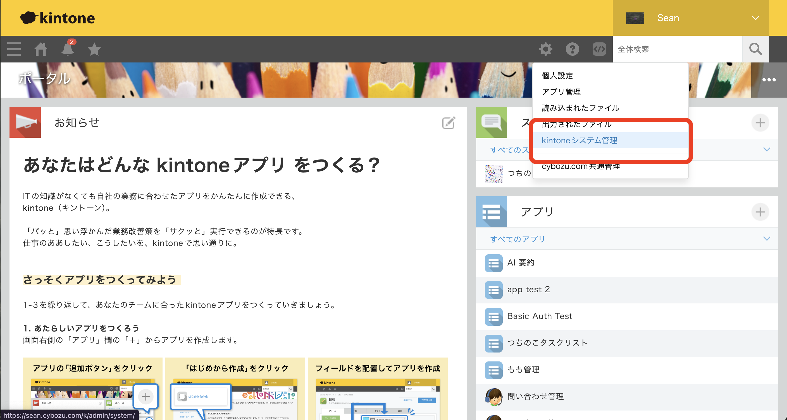
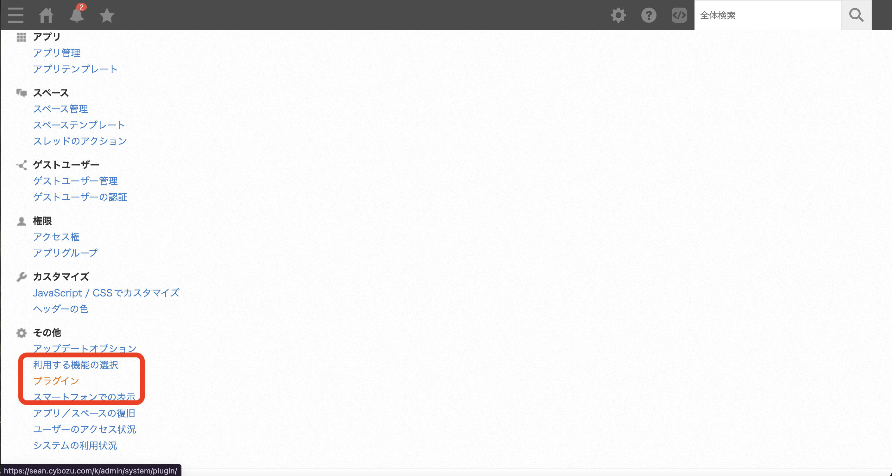
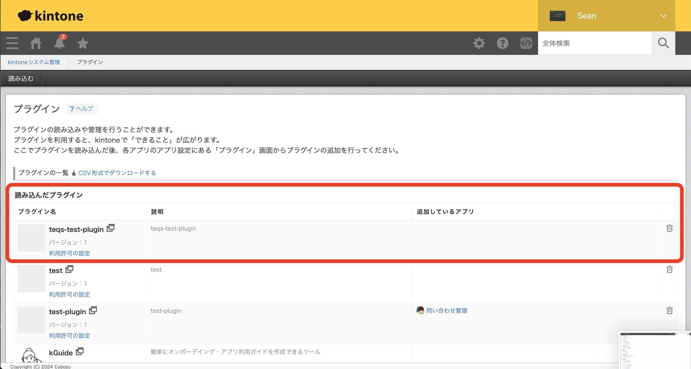

# TEQS kintone Plugin 開発セミナー

## 環境を用意する

### NodeJS

`node -v`を実行して、20以上のバージョンがインストールされているかをご確認ください

例：`v23.1.0`

## kintoneを準備する

### 開発者ライセンスを取得する

[開発者ライセンスを取得してみよう！](https://cybozu.dev/ja/kintone/developer-license/registration-form/)

kintone開発者ライセンスは、開発者がkintone APIを無料で試せる環境を提供します。顧客または自社向けの開発・テストや、開発スキルの習得に活用できます。

### デモ用アプリを追加する



ログイン後、アプリ追加画面からデモ用の「問い合わせ管理」アプリをインストールしてください。



## プラグインを作成してみよう

`npm install -g @kintone/create-plugin`

`create-kintone-plugin test-ai-plugin`

質問に対して、ホームページとアップロード以外をデフォルトで回答しましょう
ホームページも指定しないと、`customize-uploader`は失敗します。

``` txt
? Input your plug-in name in English [1-64chars] test-ai-plugin
? Input your plug-in description in English [1-200chars] test-ai-plugin
? Does your plug-in support Japanese? no
? Does your plug-in support Chinese? no
? Does your plug-in support Spanish? no
? Input your home page url for English (Optional) https://test.com
? Does your plug-in support mobile views? no
? Would you like to use @kintone/plugin-uploader? yes
```

作成したディレクトリに入って、パッケージをインストールします：

`cd test-ai-plugin`

`npm i`

### envファイルを使用してアップしましょう

`npm install dotenv`

`touch .env`

.envファイルを下記の内容でコピペする

``` txt
KINTONE_BASE_URL=https://xxx.cybozu.com
KINTONE_USERNAME=xxx
KINTONE_PASSWORD=xxx
```

ご自身のkintone環境関数を入れて保存しましょう。

### package.jsonでdotenvを使用する

uploadのコマンドの頭に 「dotenv --」 を付け足して、env関数を使用してアップを試す

``` json
"upload": "dotenv -- kintone-plugin-uploader dist/plugin.zip --watch --waiting-dialog-ms 3000"
```

## プラグインを読み込んでみよう

`npm start`

コマンドが成功したら、kintone上で確認しましょう







## 設定画面を変更してみる

## ボタンを設置する

## モダルを表示してみる

## kintoneレコード情報を取得する

## レコード情報をOpen AI APIに渡す

## 結果を表示する

## セキュリティー対策